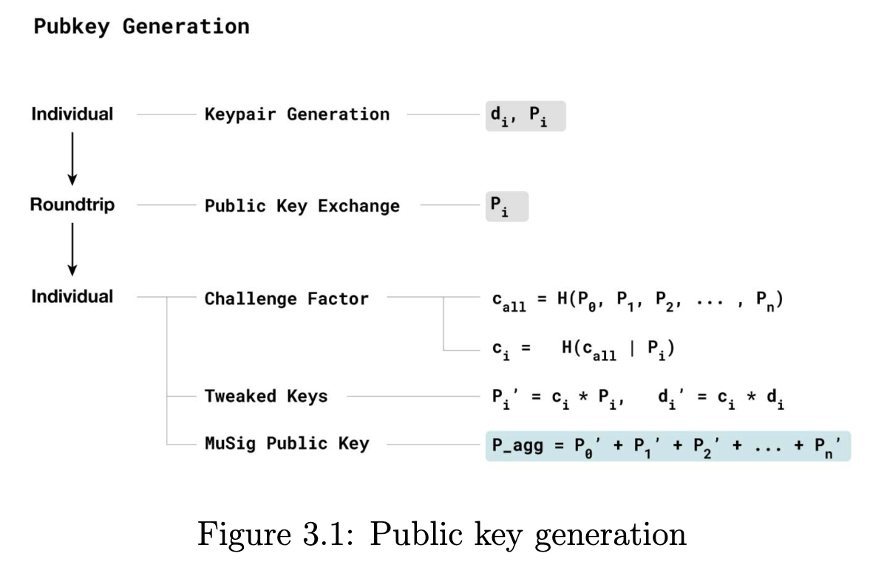
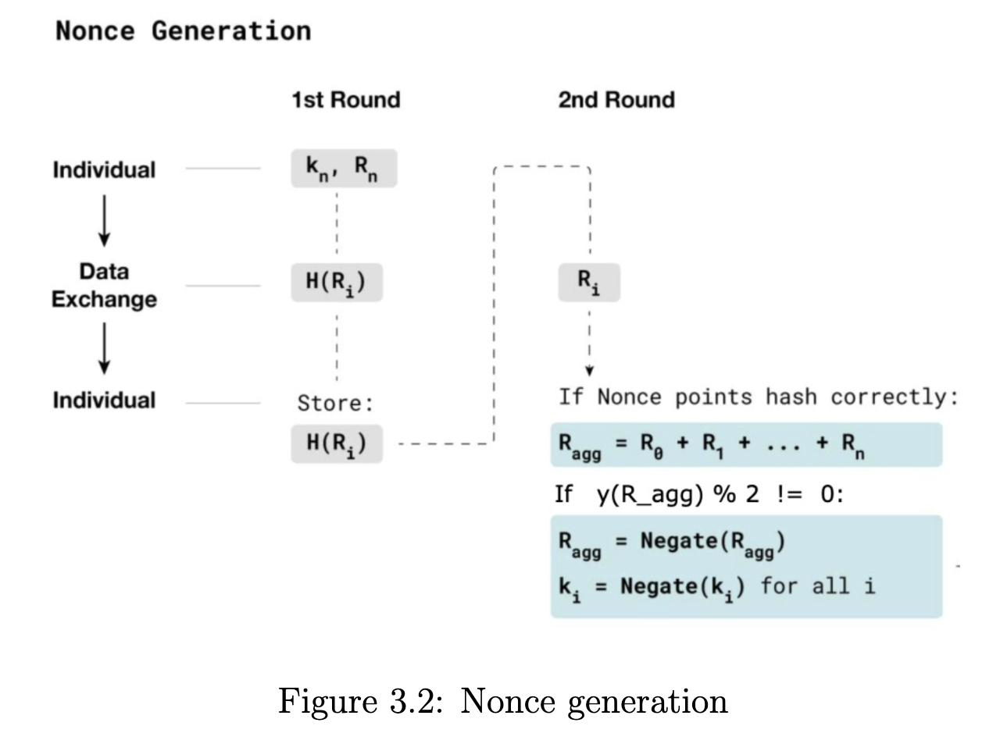
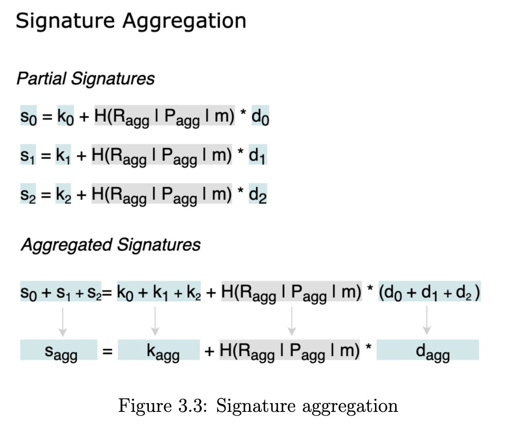

- [Schnorr](#schnorr)
  - [Tagged hash](#tagged-hash)
  - [Schnorr signature](#schnorr-signature)
    - [Signing phase](#signing-phase)
    - [Verification phase](#verification-phase)
      - [Prove](#prove)
  - [Multisig](#multisig)
    - [Public key generation](#public-key-generation)
      - [Simple public key generation](#simple-public-key-generation)
      - [Counter the key cancellation attack](#counter-the-key-cancellation-attack)
    - [None generation](#none-generation)
    - [Signature Aggregation](#signature-aggregation)

# Schnorr

## Tagged hash

Tagged hashes in Bitcoin are a way to create domain-separated hashes,
ensuring that different applications or protocols using the same hashing
function do not accidentally interfere with each other. This concept is particularly important for security and integrity in cryptographic applications.

$$tagged\_hash(tag, data) = hash(hash(tag) | hash(tag) | data)$$

Tagged hashes are used in various parts of the Bitcoin protocol, including BIP-Schnorr signatures and Taproot. These applications benefit
from the domain separation provided by tagged hashes, which enhances
security and prevents unintended interactions between different parts of
the protocol.

By using tagged hashes, developers ensure that even if two different
parts of a protocol use the same underlying hashing function and data, they
will produce different results, reducing the risk of collisions and increasing
the overall robustness of the cryptographic constructs.

## Schnorr signature

Schnorr signature variant Elliptic Curve signatures for message **m**
and public key **P**, private key **d**, and the base point **G**.

### Signing phase

Random number **k**. And calculate two value.

- $R = kG$ (R called Nonce Point and public)

- $s = k + tagged\_hash(”BIP 0340/challenge”, x(R) | x(P) | m)d$

$\rightarrow$ Signature is the pair (x(R), s)

```go
// Create a key pair for Alice
	_, aliceKeyPair := s.newKeyPair(ALICE_WALLET_SEED) // <d: private key,P: public key>
	_, nonce := s.newKeyPair("") // R = kG

	var alice_pub_point btcec.JacobianPoint
	var nonce_point btcec.JacobianPoint

	aliceKeyPair.pub.AsJacobian(&alice_pub_point) // alice_pub_point is P
	nonce.pub.AsJacobian(&nonce_point) // nonce_point is R

	// Create a message to sign
	msg := []byte("alice transaction")
	// hash the message
	hash := sha256.Sum256(msg) // m

	// create Charllenge = tagged_hash("BIP0340/challenge", R_x|P_x|msg)
	challenge := chainhash.TaggedHash(chainhash.TagBIP0340Challenge, nonce_point.X.Bytes()[:], alice_pub_point.X.Bytes()[:], hash[:])
	var e btcec.ModNScalar
	overflow := e.SetBytes((*[32]byte)(challenge))
	assert.Equal(s.t, overflow, uint32(0), "overflow")

	// create s = k + challenge * d
	sign := new(btcec.ModNScalar).Mul2(&e, &aliceKeyPair.priv.Key).Add(&nonce.priv.Key)

	schnorrSig := schnorr.NewSignature(&nonce_point.X, sign) // signature
```

### Verification phase

$\rightarrow S = R + tagged\_hash(”BIP 0340/challenge”, x(R) | x(P ) | m)P$

And check sG is or not equal S

#### Prove

- Set $challenge = tagged\_hash(”BIP 0340/challenge”, x(R) | x(P ) | m)$
- $$S = R + challenge * P$$
- $$S = R + challenge * dG$$
  because P = dG
- $$S = (k + challenge * d)G$$
  because R = kG
- $$⇒ S = sG$$

BIP340 introduces a new way to encode elliptic curve points by using
only the x-coordinate, which makes the encoding just 32 bytes. It ensures
that the y-value is always even by adjusting the private k if needed (choos-
ing -k if the y-value is odd). This way, the verifier can always determine
the y-coordinate from the x-coordinate without any ambiguity.

```go
if nonce_point.Y.IsOdd() {
		nonce_point.Y.Negate(1)
		nonce_point.Y.Normalize()
		nonce.priv.Key.Negate()
	}

	if alice_pub_point.Y.IsOdd() {
		alice_pub_point.Y.Negate(1)
		alice_pub_point.Y.Normalize()
		aliceKeyPair.priv.Key.Negate()
	}
```

Schnorr signatures bring several advantages, such as improved efficiency
and enhanced privacy, while retaining the features and security assump-
tions of ECDSA. They allow for smaller signatures, quicker verification,
and better resistance to specific attacks.

The biggest advantage of Schnorr signatures is key aggregation. This
means that multiple signatures can be combined into a single signature
that is valid for the total of the involved keys. In simple terms, Schnorr
lets multiple parties work together to create one signature that corresponds
to the sum of their public keys.

## Multisig

The MuSig protocol includes both the setup (creating an aggregate
public key for all participants) and the signing process (producing a valid
signature for the aggregate public key). The signing process involves mul-
tiple rounds of communication among the signers.

Benefit when use Multisig with Schnorr:

- Transaction Size/Fees: With MuSig, the aggregated public key and
  signature look the same as a single-key public key and signature. This
  means that the transaction size and the required fees for a multi-key
  output are no different from those for a single-key output.
- Privacy and Fungibility: Since an aggregate MuSig public key and
  signature are indistinguishable from a single-key public key and sig-
  nature, it’s impossible to use blockchain data to tell if a multi-key
  scheme was used. This enhances privacy and fungibility.

### Public key generation

#### Simple public key generation

Consider a scenario involving a 2-of-2 multisignature (multisig) scheme, where Alice and Bob each have a key pair. Alice's key pair is $(d_1, P_1)$, and Bob's key pair is $(d_2, P_2)$.

Suppose Bob, instead of sending his public key $P_2$ directly to Alice, sends $(P_2 - P_1)$ instead. If Alice naively aggregates the keys by adding $P_1$
and $(P_2-P_1)$
, the result would be:

$$P_1 + (P_2 - P_1) = P_2$$

This effectively makes the public key of the multisig equal to Bob's public key
$P_2$
​
. As a consequence, the 2-of-2 multisig would become a single key controlled entirely by Bob, giving him full permission to spend the funds associated with the multisig, while Alice is left without any control.

#### Counter the key cancellation attack

To counter the key cancellation attack, each participant’s public key
is adjusted using a challenge factor. This factor is created by hashing all
participants’ public keys together $c_i = H(c_{all} | Pi)$. This method ensures
that no participant or group of participants can generate a public key that
negates the public keys of others.

Each participant has a unique challenge factor, but these factors are all
derived from the hash of all the public keys involved.


In this example, to simplify the process of generating a public key

```go
// Create a key pair for Alice
_, aliceKeyPair := s.newKeyPair(ALICE_WALLET_SEED)

// Create a key pair for Bob
_, bobKeyPair := s.newKeyPair(BOB_WALLET_SEED)

var alice_pub_point btcec.JacobianPoint
var bob_pub_point btcec.JacobianPoint

aliceKeyPair.pub.AsJacobian(&alice_pub_point)
bobKeyPair.pub.AsJacobian(&bob_pub_point)

var pubkeyAgrr btcec.JacobianPoint
btcec.AddNonConst(&alice_pub_point, &bob_pub_point, &pubkeyAgrr)
```

### None generation

the first step of creating a multi-signature requires each signer to generate their own nonce and nonce
point. The participants then exchange those nonce points and an
aggregate nonce point is derived by summing all the nonce points.

In the security proof for MuSig, it’s crucial that nonces are randomly generated and independent of each other. This ensures that
no participant or group of participants can manipulate their nonce in
relation to others or influence the aggregate nonce point. To achieve
this, there’s an initial phase where participants commit to their nonce
points through hashing.

Each participant hashes their nonce and shares the commitment (hashed nonce) with
others. Only after receiving commitments from all participants do
they exchange their actual nonce points. Signing proceeds only if all nonce points match their respective commitments. This process prevents any participant from predicting or controlling the final aggregate nonce point, preserving the security of the MuSig protocol.



```go
// Generate a nonce
_, aliceNonce := s.newKeyPair("")
_, bobNonce := s.newKeyPair("")

var alice_nonce_point btcec.JacobianPoint
var bob_nonce_point btcec.JacobianPoint

aliceNonce.pub.AsJacobian(&alice_nonce_point)
bobNonce.pub.AsJacobian(&bob_nonce_point)

var nonceAgrr btcec.JacobianPoint
btcec.AddNonConst(&alice_nonce_point, &bob_nonce_point, &nonceAgrr)
```

### Signature Aggregation

Signature Aggregation Once all participants possess their individual
nonces and the aggregate nonce point $R$, each participant can proceed
to sign independently. The partial $s_i$ values from each participant
are then exchanged and summed together. The resulting aggregate
$s$ value, combined with the aggregate nonce point $R$, forms a valid
BIP340 signature for the aggregate public key.


```go
// Create a message to sign
msg := []byte("alice and bob transaction")
// hash the message
hash := sha256.Sum256(msg)

// create Charllenge = tagged_hash("BIP0340/challenge", R_x|P_x|msg)
challenge := chainhash.TaggedHash(chainhash.TagBIP0340Challenge, nonceAgrr.X.Bytes()[:], pubkeyAgrr.X.Bytes()[:], hash[:])
var e btcec.ModNScalar
overflow := e.SetBytes((*[32]byte)(challenge))
assert.Equal(s.t, overflow, uint32(0), "overflow")

aliceSign := new(btcec.ModNScalar).Mul2(&e, &aliceKeyPair.priv.Key).Add(&aliceNonce.priv.Key)
bobSign := new(btcec.ModNScalar).Mul2(&e, &bobKeyPair.priv.Key).Add(&bobNonce.priv.Key)

sign := new(btcec.ModNScalar).Add(aliceSign).Add(bobSign)

schnorrSig := schnorr.NewSignature(&nonceAgrr.X, sign)
```
